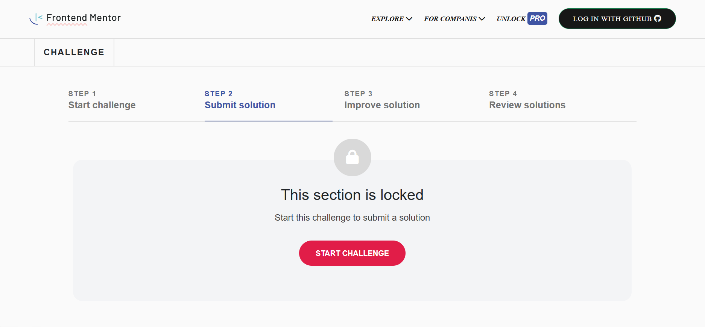

# frontend-mentor
A responsive Frontend Mentor challenge clone built using HTML, CSS, and Bootstrap with interactive UI components.
# 💻 Frontend Mentor Clone

A responsive web project inspired by Frontend Mentor challenges.
This project demonstrates UI components, layouts, and interactive elements using modern frontend technologies.

---

## ✨ Features

* 📌 Multi-step challenge interface
* 📱 Responsive design
* 🎯 Interactive tabs and sections
* 📊 Clean UI with Bootstrap
* 📂 Organized project structure

---

## 🛠️ Built With

* HTML5
* CSS3
* Bootstrap 5
* JavaScript

---

## 📸 Preview



---

## 🚀 Live Demo

(https://mahmoudkourd2004-prog.github.io/frontend-mentor/)

---

## 📂 Project Structure

```
frontend-mentor/
│── index.html
│── css/
│── js/
│── images/
```

---

## 👨‍💻 Author

Mahmoud S Elkourd

---

## 📜 License

For educational use.

---

## ⭐ Support

If you like it, give it a ⭐
